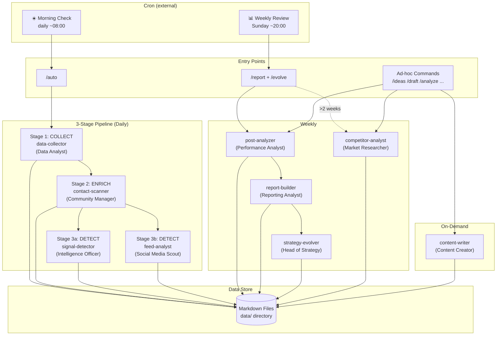
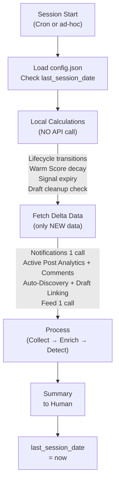
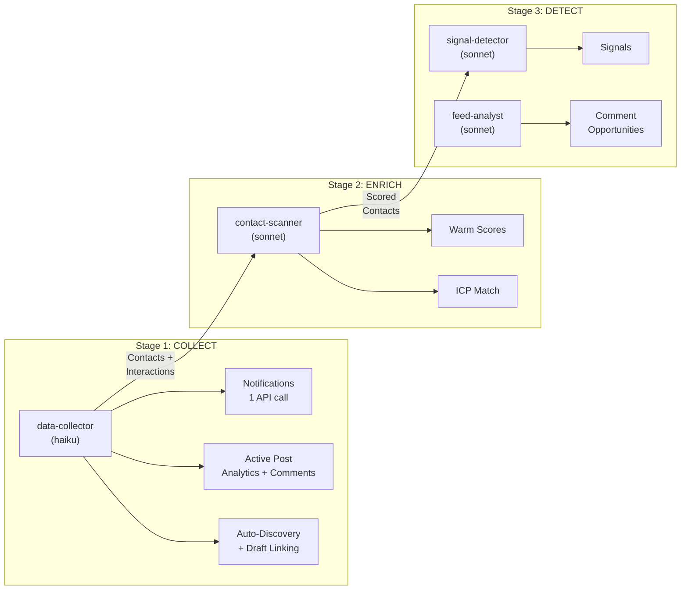
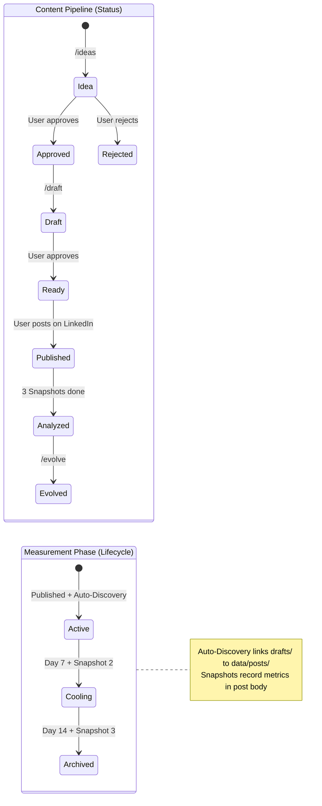
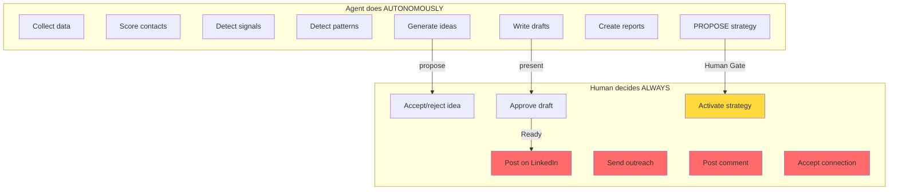
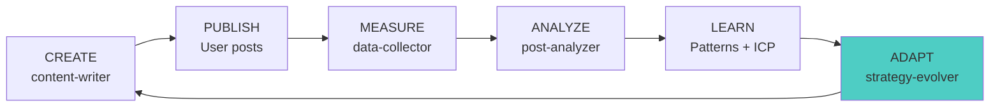
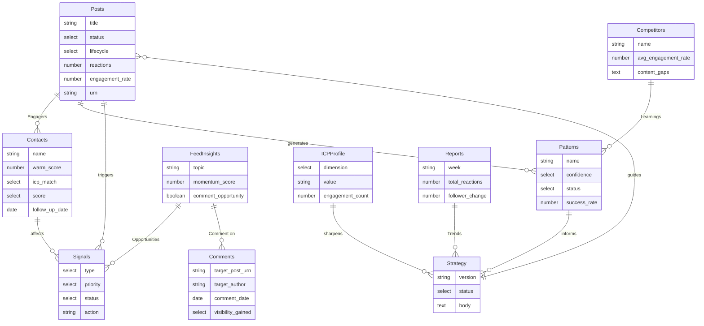
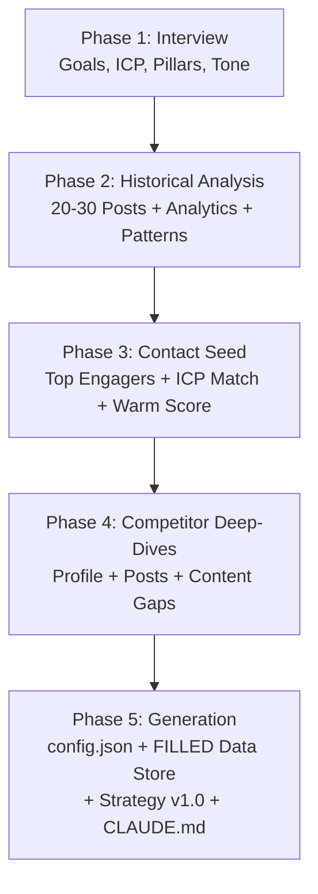

# LinkedIn Commander v3 — Plugin Architecture

Self-learning LinkedIn management system. 9 AI agents work as a cohesive marketing team in a delta-based pipeline. The system analyzes, learns, and adapts — but the human decides.

## Architecture



## Session Model



## Daily Pipeline (3 Stages)



## Post Lifecycle



## Human-in-the-Loop Gates



## Learning Loop



## Agents (Marketing Team)

| Agent | Team Role | Model | When | API Calls |
|-------|-----------|-------|------|-----------|
| data-collector | Data Analyst | haiku | Daily (Stage 1) | Notifications, Analytics |
| contact-scanner | Community Manager | sonnet | Daily (Stage 2) | None (pipeline input) |
| signal-detector | Intelligence Officer | sonnet | Daily (Stage 3a) | Keyword search |
| feed-analyst | Social Media Scout | sonnet | Daily (Stage 3b) | Feed list |
| post-analyzer | Performance Analyst | sonnet | Weekly + on-demand | None (stored data) |
| report-builder | Reporting Analyst | sonnet | Weekly + on-demand | Profile network |
| strategy-evolver | Head of Strategy | opus | Weekly + on-demand | None (synthesizes) |
| content-writer | Content Creator | sonnet | On-demand | Profile show/posts |
| competitor-analyst | Market Researcher | sonnet | On-demand / >2 weeks | Profile show/posts/engagers |

## Skills (12 Commands)

| Command | Purpose | Agents |
|---------|---------|--------|
| `/setup` | Deep onboarding (5 phases) | All |
| `/auto` | Morning Check (3-stage pipeline) | data-collector, contact-scanner, signal-detector, feed-analyst |
| `/check` | Quick status (local, no API) | None |
| `/ideas [n]` | Generate content ideas | content-writer |
| `/draft <topic>` | Write post or comment | content-writer |
| `/analyze [urn]` | Analyze post performance | post-analyzer |
| `/evolve` | Evolve strategy | strategy-evolver |
| `/report` | Weekly report | report-builder |
| `/competitor <name>` | Analyze competitor | competitor-analyst |
| `/contacts [arg]` | Contacts & network health | contact-scanner |
| `/outreach <name>` | Personalized message | content-writer |
| `data-schema` | Schema reference (not user-invocable) | — |

## Data Model



## Cron Jobs (external)

| Job | Frequency | Command | Duration |
|-----|-----------|---------|----------|
| Morning Check | Daily ~08:00 | `/auto` | ~2 min |
| Weekly Review | Sunday ~20:00 | `/report` + `/evolve` | ~5 min |

Cron is **not part of the plugin** — configured externally and calls Claude Code with session ID + CWD.

## Delta Principle

The system **never** reprocesses everything from scratch. Instead:

1. `config.json → session.last_session_date` stores when last run
2. On each start: only fetch data since last session
3. Notifications = most efficient source (1 API call = 80% of deltas)
4. Post lifecycle limits API calls: Archived posts are never touched again
5. Warm Score decay is calculated locally (no API needed)
6. Auto-discovery links new published posts to existing drafts
7. Snapshot metrics are recorded in post body at Day 3, 7, 14

## Setup = Warm Start

`/setup` does more than an interview — it analyzes existing posts, identifies engagers, detects initial patterns, and fills the data store. The first `/auto` run works with deltas, not from scratch.



## Dashboard

`plugin/dashboard.html` — Interactive HTML dashboard. No server needed, just open in browser. Ships with the plugin.

**Tabs:** Overview, Posts, Contacts, Signals, Feed, Patterns, Competitors, Strategy

- Agents write Markdown files to `data/`
- Agents know nothing about the dashboard
- Filters, sorting, charts — all client-side

## File Structure

```
linkedin-cli/
├── config.json              # Central configuration + session state
├── data/                    # All tracking data (Markdown file-per-record)
│   ├── posts/               # Active + Cooling posts (0-14 days)
│   │   └── archive/         # Mini-summaries of archived posts
│   ├── contacts/            # One .md per contact
│   ├── patterns/            # Detected patterns
│   ├── strategy/            # Versioned strategies
│   ├── reports/             # Weekly reports
│   ├── competitors/         # Competitor profiles
│   ├── signals/             # Trigger events
│   ├── feed-insights/       # Feed analysis (7-day retention)
│   ├── icp/                 # ICP dimensions
│   └── comments/            # Strategic comments
├── drafts/                  # Post drafts (.md)
├── CLAUDE.md                # Navigation map (generated by /setup)
└── plugin/
    ├── plugin.json           # Plugin manifest
    ├── README.md             # This file
    ├── dashboard.html        # Interactive dashboard
    ├── agents/
    │   ├── data-collector.md # Stage 1: COLLECT
    │   ├── contact-scanner.md # Stage 2: ENRICH
    │   ├── signal-detector.md # Stage 3a: DETECT
    │   ├── feed-analyst.md   # Stage 3b: DETECT (parallel)
    │   ├── post-analyzer.md  # Weekly: Performance
    │   ├── report-builder.md # Weekly: Reports
    │   ├── strategy-evolver.md # Weekly: Learning Loop
    │   ├── content-writer.md # On-demand: Content
    │   └── competitor-analyst.md # On-demand: Market Research
    └── skills/
        ├── setup/            # Deep onboarding (5 phases)
        ├── auto/             # Morning Check (3-stage pipeline)
        ├── check/            # Quick status (local)
        ├── ideas/            # Generate ideas
        ├── draft/            # Write post/comment
        ├── analyze/          # Analyze performance
        ├── evolve/           # Evolve strategy
        ├── report/           # Weekly report
        ├── competitor/       # Analyze competitors
        ├── contacts/         # Contacts + network health
        ├── outreach/         # Outreach messages
        └── data-schema/      # Schema reference
```

## Core Principles

1. **Delta-based** — Never rescan everything. Only new data since last session.
2. **Notifications first** — 1 API call = 80% of deltas.
3. **Post lifecycle** — Active (7d) → Cooling (14d) → Archived (never touched again).
4. **Pipeline, not silos** — Agents work sequentially: Collect → Enrich → Detect.
5. **Human-in-the-loop** — Agent analyzes and proposes. Human decides and acts.
6. **Learning loop** — strategy-evolver is the brain. Without it, the system doesn't learn.
7. **Warm start** — Setup fills the data store. No cold start.
