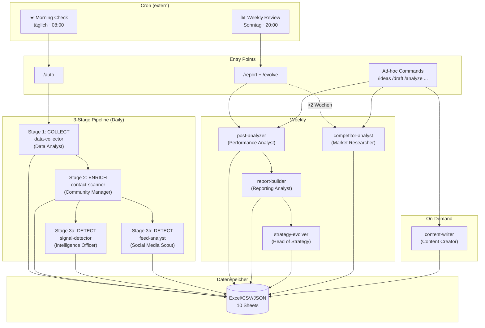
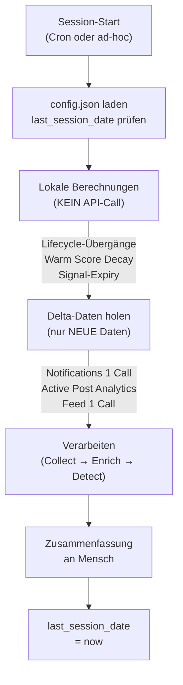
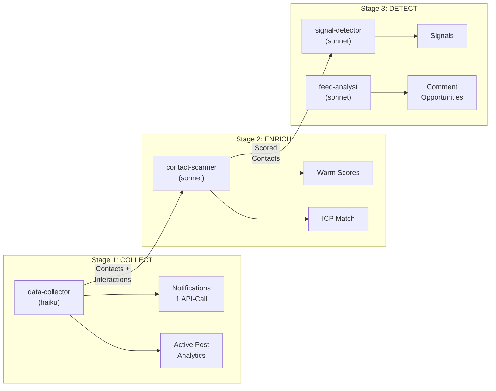
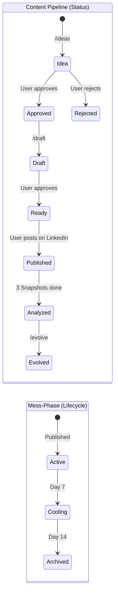
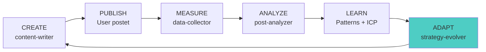
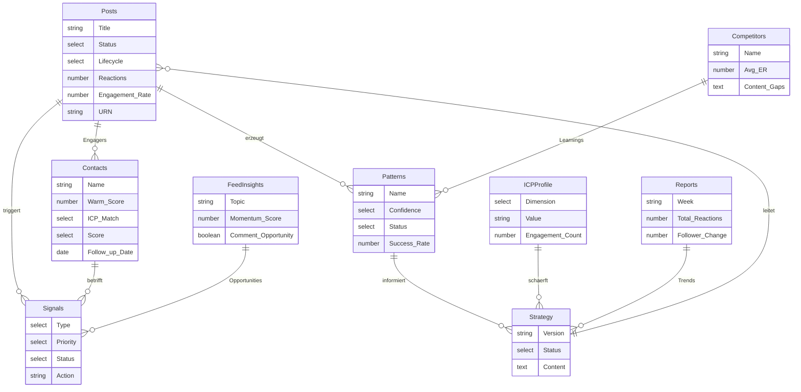
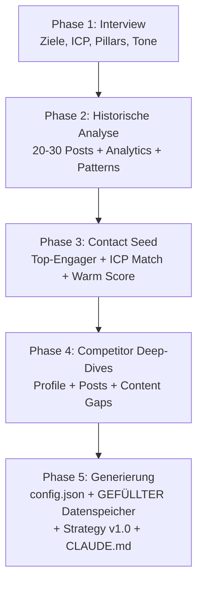

# LinkedIn Commander v3 — Plugin Architecture

Selbstlernendes LinkedIn-Management-System. 9 AI Agents arbeiten als kohärentes Marketing-Team in einer Delta-basierten Pipeline. Das System analysiert, lernt und adaptiert — aber der Mensch entscheidet.

## Architektur



## Session-Modell



## Daily Pipeline (3 Stages)



## Post Lifecycle



## Human-in-the-Loop Gates


## Learning Loop



## Agents (Marketing-Team)

| Agent | Team-Rolle | Model | Wann | API-Calls |
|-------|-----------|-------|------|-----------|
| data-collector | Data Analyst | haiku | Daily (Stage 1) | Notifications, Analytics |
| contact-scanner | Community Manager | sonnet | Daily (Stage 2) | Keine (Pipeline-Input) |
| signal-detector | Intelligence Officer | sonnet | Daily (Stage 3a) | Keywords-Search |
| feed-analyst | Social Media Scout | sonnet | Daily (Stage 3b) | Feed list |
| post-analyzer | Performance Analyst | sonnet | Weekly + on-demand | Keine (gespeicherte Daten) |
| report-builder | Reporting Analyst | sonnet | Weekly + on-demand | Profile network |
| strategy-evolver | Head of Strategy | opus | Weekly + on-demand | Keine (synthesisiert) |
| content-writer | Content Creator | sonnet | On-demand | Profile show/posts |
| competitor-analyst | Market Researcher | sonnet | On-demand / >2 Wochen | Profile show/posts/engagers |

## Skills (12 Commands)

| Command | Zweck | Agents |
|---------|-------|--------|
| `/setup` | Deep Onboarding (5 Phasen) | Alle |
| `/auto` | Morning Check (3-Stage Pipeline) | data-collector, contact-scanner, signal-detector, feed-analyst |
| `/check` | Quick Status (lokal, kein API) | Keine |
| `/ideas [n]` | Content-Ideen generieren | content-writer |
| `/draft <thema>` | Post oder Kommentar schreiben | content-writer |
| `/analyze [urn]` | Post-Performance analysieren | post-analyzer |
| `/evolve` | Strategie weiterentwickeln | strategy-evolver |
| `/report` | Wochen-Report | report-builder |
| `/competitor <name>` | Wettbewerber analysieren | competitor-analyst |
| `/contacts [arg]` | Kontakte & Network Health | contact-scanner |
| `/outreach <name>` | Personalisierte Nachricht | content-writer |
| `data-schema` | Schema-Referenz (nicht user-invocable) | — |

## Datenmodell



## Cron-Jobs (extern)

| Job | Frequenz | Command | Dauer |
|-----|----------|---------|-------|
| Morning Check | Täglich ~08:00 | `/auto` | ~2 min |
| Weekly Review | Sonntag ~20:00 | `/report` + `/evolve` | ~5 min |

Cron ist **nicht Teil des Plugins** — wird extern konfiguriert und ruft Claude Code mit Session-ID + CWD auf.

## Delta-Prinzip

Das System arbeitet **nie** alles von vorne auf. Stattdessen:

1. `config.json → session.last_session_date` speichert wann zuletzt gelaufen
2. Bei jedem Start: nur Daten seit letzter Session holen
3. Notifications = effizienteste Quelle (1 API-Call = 80% der Deltas)
4. Post-Lifecycle begrenzt API-Calls: Archived Posts werden nie wieder angefasst
5. Warm Score Decay wird lokal berechnet (kein API nötig)

## Setup = Warmstart

`/setup` macht mehr als ein Interview — es analysiert bestehende Posts, identifiziert Engager, erkennt erste Patterns und füllt den Datenspeicher. Der erste `/auto`-Run arbeitet mit Deltas, nicht von Null.



## Dashboard

`plugin/dashboard.html` — Interaktives HTML-Dashboard das `linkedin-data.xlsx` live liest (via SheetJS). Kein Server nötig, einfach im Browser öffnen. Wird mit dem Plugin ausgeliefert.

**Tabs:** Overview, Posts, Contacts, Signals, Feed, Patterns, Competitors, Strategy

- Agents schreiben in Excel — das Dashboard zeigt es an
- Agents wissen nichts vom Dashboard
- Daten sind immer aktuell (Excel wird bei jedem Öffnen live gelesen)
- Filter, Sortierung, Charts — alles client-side

## Dateistruktur

```
linkedin-cli/
├── config.json              # Zentrale Konfiguration + Session-State
├── linkedin-data.xlsx       # Datenspeicher (10 Sheets)
├── drafts/                  # Post-Entwürfe (.md)
├── CLAUDE.md                # Navigations-Karte (generiert bei /setup)
└── plugin/
    ├── plugin.json           # Plugin-Manifest
    ├── README.md             # Diese Datei
    ├── dashboard.html        # Interaktives Dashboard (liest Excel live)
    ├── agents/
    │   ├── data-collector/   # Stage 1: COLLECT
    │   ├── contact-scanner/  # Stage 2: ENRICH
    │   ├── signal-detector/  # Stage 3a: DETECT
    │   ├── feed-analyst/     # Stage 3b: DETECT (parallel)
    │   ├── post-analyzer/    # Weekly: Performance
    │   ├── report-builder/   # Weekly: Reports
    │   ├── strategy-evolver/ # Weekly: Learning Loop
    │   ├── content-writer/   # On-demand: Content
    │   └── competitor-analyst/ # On-demand: Market Research
    └── skills/
        ├── setup/            # Deep Onboarding (5 Phasen)
        ├── auto/             # Morning Check (3-Stage Pipeline)
        ├── check/            # Quick Status (lokal)
        ├── ideas/            # Ideen generieren
        ├── draft/            # Post/Kommentar schreiben
        ├── analyze/          # Performance analysieren
        ├── evolve/           # Strategie weiterentwickeln
        ├── report/           # Wochen-Report
        ├── competitor/       # Wettbewerber analysieren
        ├── contacts/         # Kontakte + Network Health
        ├── outreach/         # Outreach-Nachrichten
        └── data-schema/      # Schema-Referenz
```

## Kernprinzipien

1. **Delta-basiert** — Nie alles neu scannen. Nur neue Daten seit letzter Session.
2. **Notifications first** — 1 API-Call = 80% der Deltas.
3. **Post-Lifecycle** — Active (7d) → Cooling (14d) → Archived (nie wieder angefasst).
4. **Pipeline, nicht Silos** — Agents arbeiten sequentiell: Collect → Enrich → Detect.
5. **Human-in-the-Loop** — Agent analysiert und schlägt vor. Mensch entscheidet und handelt.
6. **Learning Loop** — strategy-evolver ist das Gehirn. Ohne ihn lernt das System nicht.
7. **Warmstart** — Setup füllt den Datenspeicher. Kein Kaltstart.
